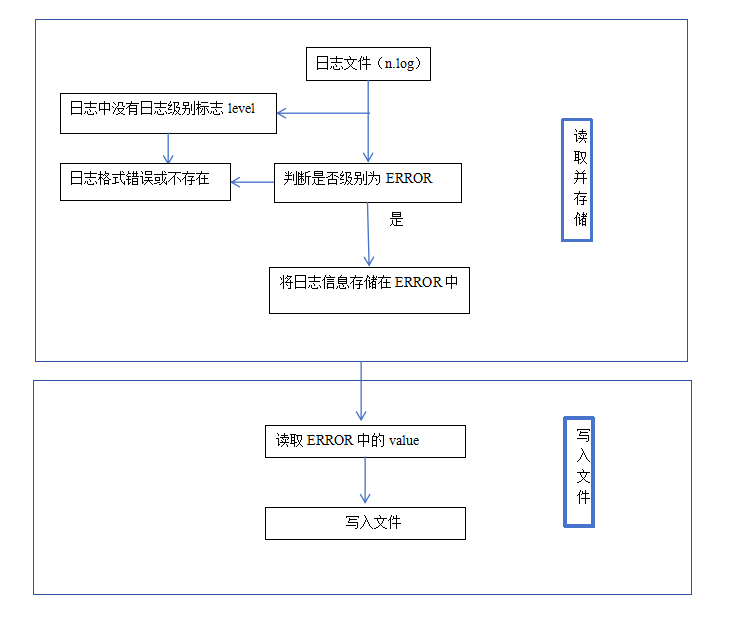

# README

## 需求分析

通过Docker容器启动ElasticSearch服务，日志文件的格式示例如下：

```
{"type": "server", "timestamp": "2024-06-04T08:55:32,991Z", "level": "INFO", "component": "o.e.x.s.c.f.PersistentCache", "cluster.name": "docker-cluster", "node.name": "c611694df9aa", "message": "persistent cache index loaded" }
```

每一行是一个日志信息，是一个JSON格式的字符串，包含类型、时间戳、日志级别、组件、集群名称、节点名称、消息。

ElasticSearch的日志级别有INFO、ERROR、WARN几种，需要把`level`为ERROR的日志信息读取出来，以合适的数据结构存储，并且写入文件中。

* **读取并存储**

​        由于不同级别的日志信息的`level`对应的不同，所以采用哈希表（HashMap）来存储，key对应的是`Error`,value对应的是此条	日志信息。是一对多的关系，key为`Error`对应的数据有多条，所以以列表(ArrayList)来存储对应的value。

* **写入文件**

	只需要逐条从map集合中读取key为`Error`的数据，并写入文件即可完成需求


## 具体设计

1. 为了程序解耦，采用枚举类来定义日志级别，只需要更改枚举类就可以记录INFO以及WARN信息。
2. 首先定义两个接口，一个负责**读取并存储**，另一个负责**写入文件**
3. 编写两个接口的实现类，重写其中的接口方法：利用BufferedReader和BufferedWriter
4. Test功能，创建写入文件的实现类，调用其中的方法，将ERROR文件输出为"output.txt"文件


